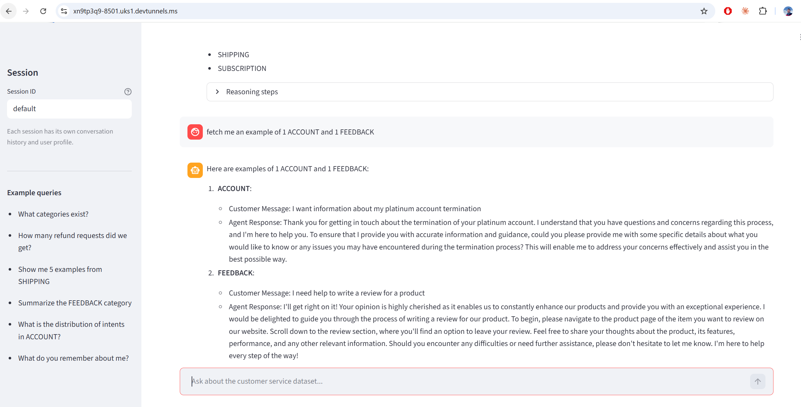

# CS Agent — Customer Service Data Analyst Agent

A LangGraph ReAct agent that answers structured and open-ended questions about the
[Bitext Customer Service dataset](https://huggingface.co/datasets/bitext/Bitext-customer-support-llm-chatbot-training-dataset)
(26,872 customer support conversations).



---

## Architecture

```
__start__
    │
  router              ← classifies query: structured / unstructured / out_of_scope
    │                                    / recommender / confirm
  ┌─┴──────────┬──────────────┬──────────────┐
agent        decline      recommender      confirm
  │  ⇄ tools  │             │               │
  │           END     update_profile      agent (executes pending query)
  │
update_profile        ← extracts and persists user facts after each turn
  │
__end__
```

### Components

| File | Role |
|---|---|
| `agent/graph.py` | LangGraph StateGraph — nodes, edges, state definition |
| `agent/tools.py` | 5 dataset tools with Pydantic schemas |
| `agent/prompts.py` | Router, agent, profile-update, and recommender prompts |
| `agent/profile.py` | Per-session user profile — load and save to JSON |
| `main.py` | Interactive CLI with persistent session memory |
| `app.py` | Streamlit chat UI (Bonus A) |
| `mcp_server/server.py` | FastMCP server exposing tools (Task 3) |

### Tools

| Tool | Description |
|---|---|
| `list_categories` | Returns all top-level categories in the dataset |
| `list_intents` | Returns intent slugs, optionally filtered by category |
| `count_records` | Counts rows matching optional category/intent filters |
| `get_samples` | Returns N example instruction-response pairs |
| `get_intent_distribution` | Returns record counts per intent for a category |

### Models

Two models are used for different roles:

| Node | Model | Reason |
|---|---|---|
| `agent`, `recommender` | `meta-llama/Llama-3.3-70B-Instruct` | Tool selection, multi-step reasoning, and contextual query suggestion benefit from full 70B capacity |
| `router`, `update_profile` | `google/gemma-3-27b-it` | Classification and JSON extraction tasks — no tool use, smaller model is sufficient |

---

## Setup

```bash
# 1. Clone the repo and enter the directory
cd cs_agent

# 2. Download the dataset
mkdir -p Bitext-customer-support-llm-chatbot-training-dataset
curl -L \
  "https://huggingface.co/datasets/bitext/Bitext-customer-support-llm-chatbot-training-dataset/resolve/main/Bitext_Sample_Customer_Support_Training_Dataset_27K_responses-v11.csv" \
  -o "Bitext-customer-support-llm-chatbot-training-dataset/Bitext_Sample_Customer_Support_Training_Dataset_27K_responses-v11.csv"

# 3. Create and activate a virtual environment
python -m venv .venv
.venv\Scripts\Activate.ps1        # Windows PowerShell
# source .venv/bin/activate        # macOS / Linux

# 4. Install dependencies
pip install -r requirements.txt

# 5. Create a .env file in the project root with your credentials:
Nebius_API_key=<your Nebius Token Factory API key>
LANGCHAIN_TRACING_V2=true          # optional — enables LangSmith tracing
LANGCHAIN_API_KEY=<your LangSmith key>
LANGCHAIN_PROJECT=cs_agent
```

---

## Running the agent

### Option 1 — CLI (with persistent memory)

```bash
python main.py                        # default session
python main.py --session my_session   # named session — restores history on restart
```

Each session is persisted to `agent/storage/checkpoints.db`. Reusing the same
`--session` name restores the full conversation history even after restarting.

Example interaction:

```
You: Show me 3 examples from the REFUND category
[Router] → structured
[Tool call] get_samples({'n': 3, 'category': 'REFUND', 'intent': None})
[Observation] get_samples: [...]

Agent: Here are 3 examples from the REFUND category: ...

You: Show me 3 more
Agent: Here are 3 more examples: ...   ← remembers context from previous turn
```

### Query Recommender (Bonus B)

Ask the agent for a suggestion, refine it, and confirm to execute:

```
You: What should I query next?
Agent: Based on your interest in invoices, I suggest seeing the distribution of
       intents in the PAYMENT category. Should I go ahead?

You: I'd rather see examples instead.
Agent: Then I'd suggest: show 5 examples from the PAYMENT category. Should I go ahead?

You: Yes, do it.
[Router] → confirm
[Confirm] Executing pending query: 'Show me 5 examples from the PAYMENT category'
Agent: Here are 5 examples from the PAYMENT category: ...
```

The agent never executes a suggestion until the user explicitly confirms.

### Option 2 — Streamlit UI (Bonus A)

```bash
streamlit run app.py
```

Opens at `http://localhost:8501`. Session ID can be set in the sidebar to switch
between or resume conversations.

### Option 3 — LangGraph Studio

```bash
pip install langgraph-cli
langgraph dev
```

Opens at `http://localhost:8123`. The graph is registered as `cs_agent` in `langgraph.json`.

---

## Connecting a client to the MCP server (Task 3)

Start the server (runs on `http://127.0.0.1:8000`):

```bash
python -m mcp_server.server
```

Call a tool from a Python client:

```python
import asyncio
from fastmcp import Client

async def main():
    async with Client("http://127.0.0.1:8000/sse") as client:
        result = await client.call_tool("count_records", {"category": "REFUND"})
        print(result.data)   # 2992

asyncio.run(main())
```

Available MCP tools: `list_categories`, `list_intents`, `count_records`, `get_samples`, `get_intent_distribution`
